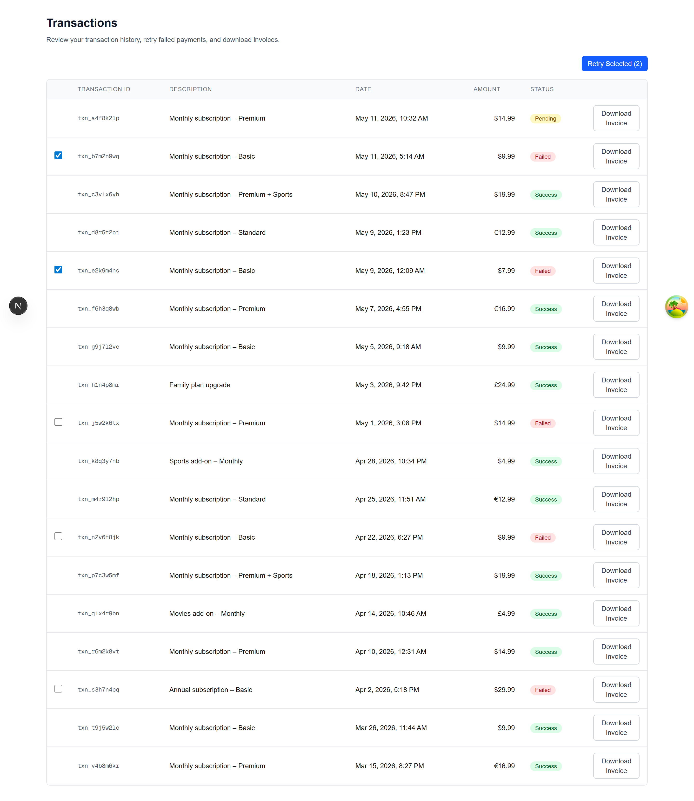

# Cleeng Transactions Dashboard

A small dashboard for a Cleeng subscriber to review their transaction history, retry failed payments in bulk with per-row independent loading state, and download invoices as PDFs. Built as a recruitment task for Cleeng.

## Demo



## Stack

- Next.js 15 (App Router) — required by task
- TypeScript (strict mode) — required by task
- TanStack Query — server state, cache as single source of truth
- MSW (Mock Service Worker) — API mocking at the network layer rather than inline `setTimeout`, so the same mocks serve dev and tests
- Tailwind CSS — utility-first styling
- sonner — toast notifications
- Vitest + Testing Library — unit and integration tests

## Run

```bash
npm install
npm run dev
```

Open http://localhost:3000.

The mock API initializes on first render (look for "[MSW] Mocking enabled." in the browser console). All data is in-memory and resets on page reload.

## Test

```bash
npm run test         # run all tests once
npm run test:watch   # watch mode
```

11 tests across 4 files: 6 unit tests for formatters, 5 integration tests for the table, retry flow, and download flow.

## Architectural decisions

### Per-row retry state, with the cache as truth

The retry feature fires concurrent API calls and updates each row independently as its call resolves. Two state concerns separate cleanly:

- **Selection and "is this row currently retrying"** live in a local React hook (`useTransactionsState`). These are pure UI concerns.
- **The transaction's status itself** lives in the TanStack Query cache. When a retry resolves, the hook calls `queryClient.setQueryData` to mutate the cached transaction. The row re-renders because the underlying data changed, not because a separate "override" state layer was added.

Using `setQueryData` as the single source of truth means TanStack Query DevTools always reflects what's on screen — no parallel state to keep in sync. The only configuration cost is disabling `refetchOnWindowFocus`, since our mock API is stateless and a refetch would clobber retry results with the original failed statuses. In a real backend, that flag goes back on.

### Promise.allSettled for concurrent retries

`Promise.all` rejects the whole batch on a single rejection. With a 20% simulated failure rate, that would cancel pending retries the moment any one of them throws. `Promise.allSettled` lets each retry resolve or reject independently — and inside the per-id async callback, each cache write happens at its own moment in time. That's what produces the staggered "rows resolving one by one" UX, which is the core requirement of this task.

### MSW over inline mocking

The alternative — `setTimeout` inside an `api.ts` module — works for a demo but creates two problems: (1) tests need their own separate mocking pattern, duplicating the API surface; (2) mock data isn't visible in the Network tab, making the app harder to debug. MSW intercepts at the network layer, so the same handlers serve both the running app and the test suite (`setupWorker` in the browser, `setupServer` in Vitest). One source of truth for what the API does.

## Testing approach

Five integration tests cover the critical paths, with the per-row concurrent retry test designed to fail if the implementation regresses to sequential. After writing that test, I temporarily replaced `Promise.allSettled` with a sequential `for...of` loop to confirm the test actually caught the regression — it failed on the staggered-timing assertion, which gave me confidence the test was meaningful rather than just green.

Six unit tests cover the date and currency formatters in isolation, using `toContain` rather than `toBe` to stay robust against locale and Node version differences in `Intl.DateTimeFormat` output.

## What I'd add with more time

- E2E tests with Playwright covering the full user flow in a real browser, not jsdom.
- Pagination or virtualization — the current table renders all rows. Fine for 18, not for 18,000.
- Filtering and sorting (by date, status, amount), with state in the URL via `nuqs` so views are shareable.
- Optimistic UI for retry: immediately reflect the pending state before the API responds, rolling back on error.
- Accessibility audit — current keyboard navigation and screen reader labels are basic; would tighten focus management around the retry flow.

## Notes on AI tooling

I used Claude Code as a development partner for this task. Architecture decisions (per-row state shape, cache-as-truth vs local overrides, test design for concurrent behavior) were explicit choices I made and can defend; the AI helped draft and refactor code against constraints I specified in a project-level `CLAUDE.md`. The commit history reflects incremental decisions rather than bulk generation.
